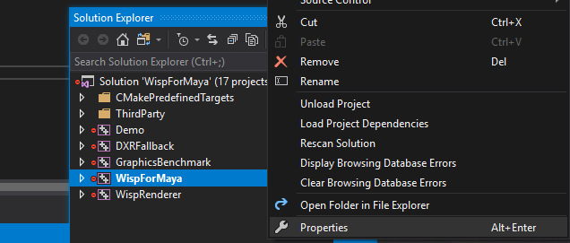
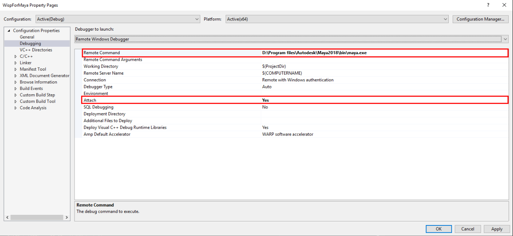

# Maya-Ray-Traced-Viewport-Plugin
Bringing real-time ray-tracing to the Maya viewport using the Wisp real-time ray-tracing library.

# Installation

## Instructions

1. Copy the .mll file.

   1. **Developers**, build the project and navigate to ```bin/Debug``` or ```bin/Release```, depending on the chosen configuration. Copy the `.mll` file.
   2. **Regular users**, grab a copy of the `.mll` file from the releases on GitHub.

2. Paste the `.mll` file in the Autodesk Maya plug-ins folder. Depending on your personal Autodesk Maya configuration, this could be different for you.

   By default, the Autodesk Maya installation folder contains a `/plug-ins` folder, the `.mll` file can be placed in here. However, this is considered bad practice. Instead, create a folder somewhere on your computer and add an **environment variable** that points to the newly created folder. Inside this folder, create three sub-directories: *plug-ins*, *icons*, and *scripts*.

   In both cases, the `.mll` should be pasted in the `/plug-ins` folder.

3. Open the plug-in manager and load the plug-in. Alternatively, the MEL `loadPlugin` command can be used. If these two options fail, restart Autodesk Maya. The plug-in should show up now.


# Developers

Before running the installer, install the Maya dev-kit (if needed), and create an environment variable called `MAYA_2018_DIR`. This environment variable should point to your `<installation/path>/Autodesk/Maya2018` folder.


Download this repository and run the **install.bat** file on your machine. If you are compiling this on a different platform, you may have to run CMake manually.

## Debugging

The instructions below assume that the Visual Studio Debugger is used for plug-in development. If you use any other debugger, the guide below does not apply to you.

Please check your debugger documentation to find out how to attach to a running process.

### Setting up the Windows Remote Debugger in Visual Studio

1. Right-click on the project and open the properties.

   

2. Go to the **debugging** settings. By default, Visual Studio uses the *Local Windows Debugger*, change this into *Remote Windows Debugger*.

   

3. After selecting the *Remote Windows Debugger*, new settings will appear. There are two settings that need to be changed:

   1. **Remote command**
      The remote command is the command that run once the *Remote Windows Debugger* is launched.
      Set this to the location of `maya.exe`. The location of the executable depends on your installation settings, but by default it is located here: `C:\Program Files\Autodesk\Maya2018\bin\maya.exe`.

   2. **Attach**
      If you were to launch the *Remote Windows Debugger* right now, a new instance of Maya will be launched. This is not something you want when debugging an application, so change this setting to `Yes`.

   

4. To make it easy to launch the *Windows Remote Debugger*, click the arrow next to *Local Windows Debugger* and select the *Remote Windows Debugger*. Now, every time that button is clicked (shortcut: `F5`), the *Remote Windows Debugger* is used instead of the *Local Windows Debugger*.

   

Thanks a lot, [Nick Cullen](https://nickcullen.net/blog/misc-tutorials/how-to-debug-a-maya-2016-c-plugin-using-visual-studio-2015/), for the step-by-step instructions on how to get the Remote Windows Debugger to work with Autodesk Maya 2018.