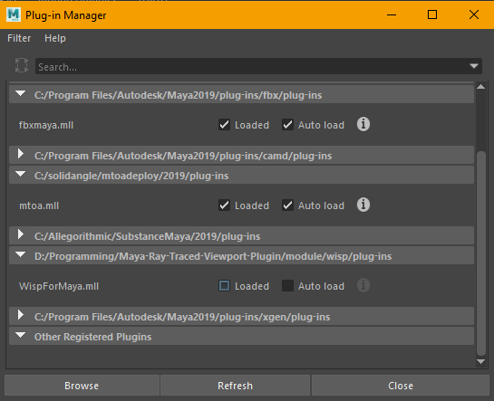
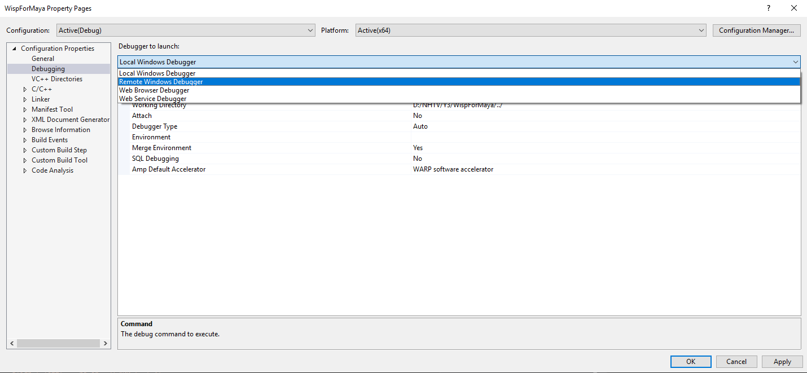
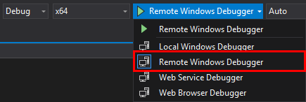

# Maya-Ray-Traced-Viewport-Plugin
Bringing real-time ray-tracing to the Maya viewport using the [Wisp real-time ray-tracing library](https://github.com/TeamWisp/WispRenderer).

# Table of contents

- [Maya-Ray-Traced-Viewport-Plugin](#maya-ray-traced-viewport-plugin)
- [Table of contents](#table-of-contents)
- [Installation](#installation)
    - [1. Download](#1-download)
    - [2. setup](#2-setup)
    - [3. Load plug-in](#3-load-plug-in)
    - [4. Result](#4-result)
- [Plug-in development](#plug-in-development)
  - [Debugging](#debugging)
    - [Project properties](#project-properties)
    - [Select the Remote Windows Debugger](#select-the-remote-windows-debugger)
    - [Windows Remote Debugger settings](#windows-remote-debugger-settings)
    - [Select the Windows Remote Debugger](#select-the-windows-remote-debugger)

# Installation
### 1. Download
- **Users**
    - Expect a installer soon. For now follow developer instructions.
- **Developers**
   1. download or clone repository.
   2. make sure you have CMake 3.13 or higher and Windows SDK 10.0.17763.0 or newer installed
   3. create an environment variable called `MAYA_SDK_DIR`. This environment variable should point to your `<installation/path>/Autodesk/<version>` folder.

   4. Run install.bat , when asked to update submodules choose yes.
   5. Build generated solution, preferably with visual studio. ```cmake --build``` also works

### 2. setup
- **Users**
    - Expect a installer soon. For now follow developer instructions.
- **Developers**
    1. copy wisp-template.mod to:
        1. if ```MAYA_MODULE_PATH``` **is not** set, any of the following directories
            -   ```<user’s directory>/My Documents/maya/<version>/modules```

            -   ```<user’s directory>/My Documents/maya/modules```

            -   ```C:/Program Files/Common Files/Autodesk Shared/Modules/maya/<version>```

            -   ```C:/Program Files/Common Files/Autodesk Shared/Modules/maya```

            -   ```<maya_directory>/modules/```
        2. if ```MAYA_MODULE_PATH``` **is** set
            -   the specified path
    2. rename wisp-template.mod to wisp.mod
    3. open wisp.mod and edit line 1: <GIT REPO LOCATION> to be equal to the location of the repository.


### 3. Load plug-in
Open Maya and open the plug-in manager. Load the plug-in. Alternatively, the MEL `loadPlugin` command can be used. If these two options fail, restart Autodesk Maya. The plug-in should show up now.

### 4. Result


# Plug-in development

## Debugging

The instructions below assume that the Visual Studio Debugger is used for plug-in development. If you use any other debugger, the guide below does not apply to you.

Please check your debugger documentation to find out how to attach to a running process.

### Project properties
Right-click on the project and open the properties.


### Select the Remote Windows Debugger

Go to the **debugging** settings. By default, Visual Studio uses the *Local Windows Debugger*, change this into *Remote Windows Debugger*.



### Windows Remote Debugger settings

After selecting the *Remote Windows Debugger*, new settings will appear. There are two settings that need to be changed:

1. **Remote command**
   The remote command is the command that run once the *Remote Windows Debugger* is launched.
   Set this to the location of `maya.exe`. The location of the executable depends on your installation settings, but by default it is located here: `C:\Program Files\Autodesk\<version>\bin\maya.exe`.

   <u>Please note that the backslashes (`\`) are required. Using forward slashes (`/`) will cause the Windows Remote Debugger to fail to attach to the Maya process.</u>

2. **Attach**
   If you were to launch the *Remote Windows Debugger* right now, a new instance of Maya will be launched. This is not something you want when debugging an application, so change this setting to `Yes`.


### Select the Windows Remote Debugger

To make it easy to launch the *Windows Remote Debugger*, click the arrow next to *Local Windows Debugger* and select the *Remote Windows Debugger*. Now, every time that button is clicked (shortcut: `F5`), the *Remote Windows Debugger* is used instead of the *Local Windows Debugger*.



Thanks a lot, [Nick Cullen](https://nickcullen.net/blog/misc-tutorials/how-to-debug-a-maya-2016-c-plugin-using-visual-studio-<version>/), for the step-by-step instructions on how to get the Remote Windows Debugger to work with Autodesk Maya 2018.
